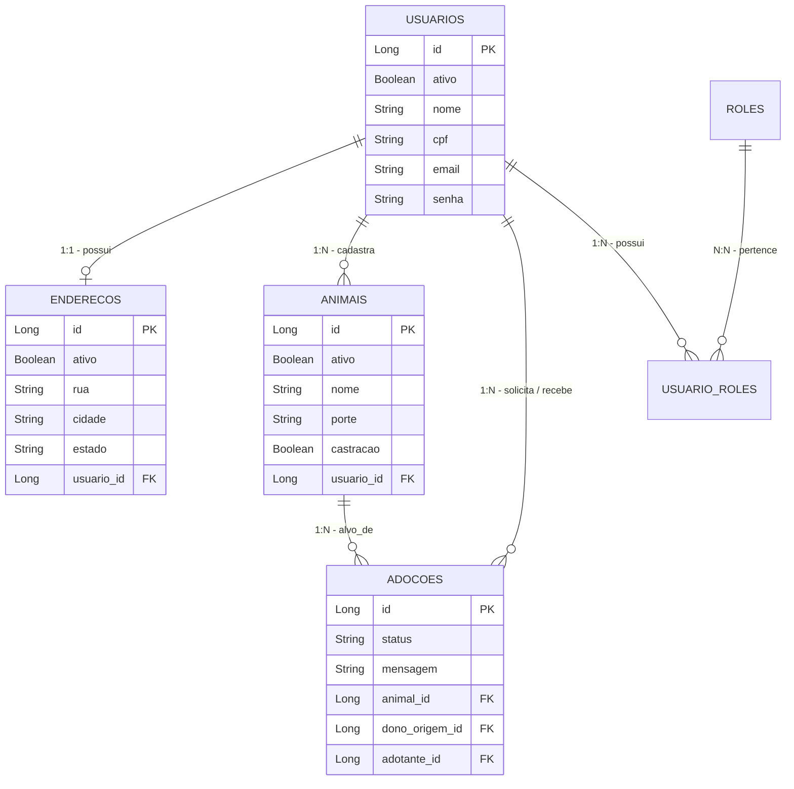

# 🐾 Projeto Adoção
Um sistema completo de adoção de animais desenvolvido em Java com Spring Boot, focado em conectar pessoas que desejam adotar pets com aqueles que estão disponibilizando animais para adoção. 
O sistema inclui gerenciamento de usuários, animais, controle rigoroso do fluxo de adoções, autenticação JWT e documentação interativa.

# 🚀 Tecnologias e Frameworks
O projeto foi construído utilizando as seguintes tecnologias e boas práticas:
- Java 21
- Spring Boot 3.3.5: (Web, Data JPA, Security, Validation)
- PostgreSQL: Banco de dados relacional (via Docker/Testcontainers)
- Flyway: Versionamento e migrações do banco de dados (SQL)
- Spring Security & JWT (Auth0): Autenticação e autorização stateless
- Springdoc OpenAPI (Swagger): Documentação interativa da API REST
- Docker & Docker Compose: Containerização da aplicação e banco de dados
- JUnit 5 & Mockito: Para testes unitários
- Testcontainers: Para testes de integração isolados com banco de dados real
- Maven: Gerenciamento de dependências e build

# 📁 Organização das Pastas
A arquitetura do projeto foi pensada de forma modular, separando as responsabilidades de negócio e configurações de infraestrutura:
```Plaintext
src/main/java/com/adocao/Projeto_Adocao/
├── Application/       # Core da aplicação (Regras de negócio, Controllers, Services, Repositories)
│   ├── Admin/         # Endpoints exclusivos para administradores
│   ├── Adocao/        # Fluxo de solicitação, aprovação e rejeição de adoções
│   ├── Animal/        # Gerenciamento (CRUD) de animais e vitrine
│   ├── Auth/          # Login, Cadastro e reativação de contas
│   ├── DTO/           # Data Transfer Objects auxiliares
│   ├── Endereco/      # Gerenciamento do endereço do usuário
│   └── Usuario/       # Entidade principal de usuários e roles
├── Doc/               # Configurações do Swagger/OpenAPI
└── Infra/             # Configurações globais e mecanismos auxiliares
    ├── Exception/     # Tratamento global de erros (Handlers e Exceções Customizadas)
    └── Security/      # Configurações do Spring Security, Filtros, Senhas e Token JWT

src/main/resources/
├── db.migration/      # Scripts SQL do Flyway para criar e popular o banco de dados
└── application.yaml   # Configurações do ambiente da aplicação
```
# 🗄️ Organização do Banco de Dados (UML)
O relacionamento das entidades foi estruturado da seguinte forma:


# ⚙️ Regras Lógicas de Negócio
- **Usuário ➔ Endereço (1:1):** Cada usuário logado possui apenas um endereço atrelado a ele. O cadastro é bloqueado caso o usuário já possua um endereço (devendo usar a rota de edição).
- **Usuário ➔ Animal (1:N):** Um usuário pode ser dono de vários animais disponíveis para adoção.
- **Desativação em Cascata (Soft Delete):** A aplicação não deleta registros permanentemente do banco para preservar o histórico.
Porém, há um mecanismo de cascata lógica: quando um usuário inativa a própria conta (``/usuarios/inativar``), o sistema automaticamente altera o status do ``Usuário``, do seu ``Endereço`` e inativa todos os ``Animais`` vinculados a ele.

# 📄 Paginação
A API foi construída para suportar larga escala de dados. Utilizamos a interface ``Pageable`` do Spring Data JPA nas requisições que retornam listas, garantindo performance.
- Animais (``/animais`` e ``/animais/me``): Paginação implementada para listar a vitrine de animais disponíveis, aceitando filtros dinâmicos de busca (porte, castração, raça).
- Adoções (``/adocoes/*``): Paginação para consultar requisições de adoção feitas pelo usuário ou recebidas para seus animais.

# 🛡️ Segurança: Spring Security e Token JWT
- **Stateless Authentication:** O projeto usa segurança sem estado via Tokens JWT (JSON Web Token), gerenciado pela biblioteca Auth0.
- **Tokens JWT:** Uso do record JWTUserData, que funciona como um DTO carregando as informações essenciais do usuário (ID e Roles) dentro do próprio token.
  - Captura de Contexto: No filtro de segurança, os dados do token são injetados no contexto do Spring.
  - Uso nos Controllers: Para identificar o usuário logado de forma limpa e segura, utilizei da anotação @AuthenticationPrincipal. Evita consultas desnecessárias ao banco apenas para obter o ID do solicitante.
    ```Java
    @GetMapping("/me")
    public ResponseEntity<UsuarioMeResponse> findUserById(@AuthenticationPrincipal JWTUserData jwtUserData) {
        // O ID já vem mapeado do Token via DTO
        UsuarioMeResponse user = usuarioService.findUserById(jwtUserData.id());
        return ResponseEntity.ok().body(user);
    }
    ```
- **Controle por ROLEs:** Implementado um sistema de Roles (``USER``, ``ADMIN``).
  - Embora o escopo atual do sistema exija apenas permissões de ``USER`` para grande parte das ações, as ROLES foram implementadas a nível de estudo estrutural.
Isso é validado nas rotas ``/admin/**``, controladas pela anotação @``PreAuthorize("hasRole('ADMIN')")`` e cobertas por testes de integração (``AdminControllerIT``).
  

# 🛑 Exceptions Personalizadas e Tratamento Global
Para manter as respostas da API consistentes (padrão de classe ``ApiError``), os erros foram encapsulados em um ``GlobalExceptionHandler`` utilizando a anotação ``@RestControllerAdvice``.
Foram criadas exceções personalizadas mapeadas para códigos HTTP específicos:
- ``BusinessRuleException (400 - Bad Request)``: Quando regras de domínio são quebradas (ex: adotar o próprio animal).
- ``ForbiddenOperationException (403 - Forbidden)``: Quando um usuário tenta agir sobre recursos de terceiros (ex: rejeitar adoção de um animal que não é dele).
- ``ResourceNotFoundException (404 - Not Found)``: Quando um ID buscado não existe no banco de dados.

# 🧪 Testes Unitários e de Integração
Boa suíte de testes que assegura o funcionamento das regras lógicas e bloqueios de segurança. O padrão estrutural utilizado foi o **AAA - Arrange, Act, Assert**.
- **Testes Unitários (``AdocaoServiceTest``)**: Focado em validar as regras de negócio de forma isolada.
  ```Java
  @Test
  @DisplayName("Deve lançar ForbiddenOperationException quando um usuário não envolvido tentar ver a adoção")
  void buscarDetalhesAdocao_DeveFalhar_QuandoUsuarioForUmInvasor() {
      // Arrange: Adocao pertence ao adotanteId=1 e donoId=2. Invasor=99
      JWTUserData jwtUserDataInvasor = new JWTUserData(99L, "Hacker", List.of("USER"));
      when(adocaoRepository.findById(adocaoId)).thenReturn(Optional.of(adocao));
  
      // Act & Assert
      assertThrows(ForbiddenOperationException.class, () -> {
          adocaoService.buscarDetalhesAdocao(jwtUserDataInvasor, adocaoId);
      });
  }
  ```
- **Testes de Integração**: Sobem todo o contexto do Spring com ``@SpringBootTest`` e utilizam ``Testcontainers`` para subir uma instância real do PostgreSQL num container Docker apenas para testes (lendo o ``application-test.yaml``).
O ``MockMvc`` simula as chamadas HTTP.
  - **Validação de Role ADMIN:** Garante que apenas usuários autorizados acessam endpoints administrativos.
  - **Desativação em Cascata:** Valida se o banco de dados reflete a inativação de todas as entidades ligadas ao usuário.
  ```Java
  @Test
  @DisplayName("Deve retornar 204 No Content e desativar usuário, endereço e animais em cascata")
  void alterarStatus_DeveDesativarEmCascata_QuandoStatusForFalse() throws Exception {
      mockMvc.perform(post("/usuarios/inativar")
              .header("Authorization", "Bearer " + tokenUsuario))
              .andExpect(status().isNoContent());
  
      // Assert DB: Garante que a inativação propagou para outras tabelas
      assertFalse(usuarioRepository.findById(usuarioId).get().getAtivo());
      assertFalse(enderecoRepository.findById(enderecoId).get().getAtivo());
      assertFalse(animalRepository.findById(animalId).get().getAtivo());
  }
  ```

# 💻 Como Executar o Projeto
A aplicação foi totalmente dockerizada
1. Certifique-se de ter o Docker e Docker Compose instalados.
2. Na raiz do projeto, execute:
   ```bash
   docker-compose up -d --build
   ```
### Usuário Padrão (Seed)
Para facilitar o acesso inicial e os testes, o sistema já vem com um usuário administrativo pré-cadastrado via migração do Flyway.
- **Login (CPF):** 00000000000
- **Senha:** admin (Criptografada como $2a$12$... no banco)
- **Permissões:** Possui as roles USER e ADMIN.

### Links para interagir e visualizar o funcionamento do projeto:
- Swagger (OpenAPI): Documentação interativa para testar as requisições, endpoints e visualizar os schemas.
  ```link
  http://localhost:8080/swagger-ui/index.html
   ```
- PgAdmin 4: Interface gráfica para manipular o banco de dados diretamente via navegador.
  ```link
  http://localhost:5050
   ```
  - **Email de login:** admin@admin.com
  - **Senha:** admin

# 🛠️ Como Executar os Testes
Para executar as suítes de testes localmente (você precisará ter o Java instalado na máquina ou na IDE):
- **Todos os testes (Unitários e de Integração):** 
  Como os testes de integração requerem o Docker instalado na máquina (para o Testcontainers levantar o Postgres temporário), certifique-se que o serviço Docker da sua máquina (Docker Desktop) esteja em execução.
  ```bash
   ./mvnw test
   ```
